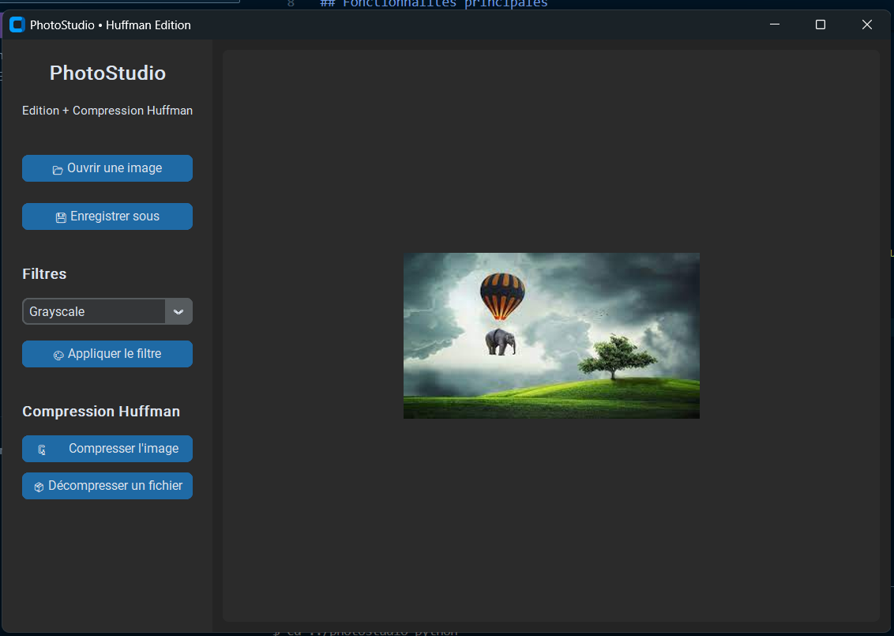
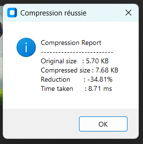

# PhotoStudio — Image Editor & Huffman Compressor

PhotoStudio est une application composée de deux parties :

1. Une interface Python permettant de visualiser, modifier et filtrer des images.
2. Un compresseur/décompresseur Huffman écrit en C, utilisé pour réduire la taille des fichiers de manière entièrement lossless.

## Fonctionnalités principales

### Éditeur d'images (Python, CustomTkinter + Pillow)

- Ouverture d'images PNG
- Prévisualisation dans l'interface
- Exportation en PNG
- Application de filtres :
  - Grayscale
  - Sepia
  - Negative
  - Blur
  - Sharpen
  - Edge Enhance
  - Brightness +/-



### Compression Huffman (C)

- Implémentation complète de l’algorithme de Huffman
- Compression sans perte en fichier `.huff`
- Décompression totale vers un fichier `.png`
- Calcul automatique dans l’interface :
  - taille originale
  - taille compressée
  - pourcentage de réduction
  - temps de compression (ms)



Le programme C génère un binaire `huff` utilisé par la partie Python via `subprocess`.

## Dépendances

### Python

- customtkinter
- pillow

Installation :

```bash
pip install customtkinter pillow
```

### C (MSYS2 / MinGW64)

```bash
cd compressor_c
mingw32-make
```

### Lancer l'application

```bash
python main.py
```

### Objectif du projet

Ce projet démontre :

- l’implémentation d’un algorithme de compression en C,
- l’intégration d’un binaire C dans une application Python,
- la manipulation d’images avec Pillow,
- la réalisation d'une interface graphique moderne et fonctionnelle.
